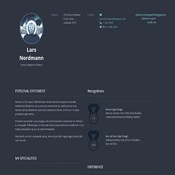

# Nord Resume Theme for Grav



**Nord Resume** is a modern, privacy-focused adaptation of the classic [Resume Theme](https://github.com/getgrav/grav-theme-resume). It has been completely re-engineered with the elegant [Nord color palette](https://www.nordtheme.com/), automatic Dark/Light mode, and a local FontAwesome 7 icon system.

# Features

* ❄️ **Nord Color Palette:** Uses the official Nord colors for a consistent, arctic elegance.
* 🌓 **Auto Dark/Light Mode:** Automatically detects system preferences (`prefers-color-scheme`).
* 🚀 **FontAwesome 7:** Upgraded icon system (v7.1.0) using **local assets** (no external CDN, fully GDPR compliant).
* 🔧 **Configurable:** Admin Panel options for Gravatar, Footer text, and Credits.
* 📱 **Fully Responsive:** Based on the Foundation framework.
* **Classic Layouts:** Preserves the beloved layouts (Timeline, Skills, Specialities) of the original theme.

# Installation

The easiest way to get started is to use the **Skeleton** package (which includes Grav + Theme + Content). Download it from the [Skeleton Repository](https://github.com/megvadulthangya/grav-skeleton-resume-nordic-site).

If you want to install **only the theme** into an existing Grav site:

## Manual Installation

1. Clone this repository into your `user/themes` directory:
   ```bash
   git clone [https://github.com/megvadulthangya/grav-theme-resume-nordic.git](https://github.com/megvadulthangya/grav-theme-resume-nordic.git) user/themes/resume-nordic
````

2.  Enable the theme in your `user/config/system.yaml`:
    ```yaml
    pages:
      theme: resume-nordic
    ```

> **NOTE:** This theme requires the [Grav](http://github.com/getgrav/grav), [Error](https://github.com/getgrav/grav-theme-error), and [Problems](https://github.com/getgrav/grav-plugin-problems) plugins.

# Configuration

Unlike the original theme, Nord Resume is configurable via the **Grav Admin Panel**.

Go to **Themes \> Nord Resume** to configure:

  * **Gravatar:** Enable/Disable, set Email, and adjust Size (slider).
  * **Footer:** Custom copyright text.
  * **Credits:** Show/Hide "Powered by" text.
  * **Dropdown:** Enable/Disable menu dropdowns.

Alternatively, you can edit `user/config/themes/resume-nordic.yaml`.

# Layouts & Content

To use the theme's special features, you need to structure your Markdown content correctly.

## Specialities

Location: `pages/left/my-specialities/special.md`

```markdown
- icon: lightbulb
  text: Logo Design
  animation: fadeInDown
```

  * **icon**: Use modern [FontAwesome 7](https://fontawesome.com/search?o=r&m=free) names (e.g., `lightbulb`, `layer-group`).
  * **animation**: [Animate.css](https://daneden.github.io/animate.css/) class.

## Skills

Location: `pages/left/design-skills/skills.md`

```markdown
- name: Adobe Photoshop
  level: 8
```

  * **level**: 1-8 (Visual dots).

## Experience (Work History)

Location: `pages/right/experience/experience.md`

```markdown
- date: 2018 - Present
  role: Senior Developer
  company: Tech Corp
  years: 5+
  description: "You can now use <b>HTML</b> tags here!"
```

## Hobbies and Interests

Location: `pages/right/hobbies-and-interests/interests.md`

**Important:** Use FontAwesome 7 icon names\!

```markdown
- icon: camera-retro
  text: Photography
  animation: fadeIn
- icon: person-hiking
  text: Hiking
```

# Credits

  * Original Theme by [Fernando Báez](https://www.behance.net/gallery/FREE-Resume-Template/15677411) & [Grav Team](https://github.com/getgrav/grav-theme-resume).
  * Nord Adaptation by [Gábor Gyöngyösi](https://github.com/megvadulthangya).
  * Color Palette by [Arctic Ice Studio](https://www.nordtheme.com/).
